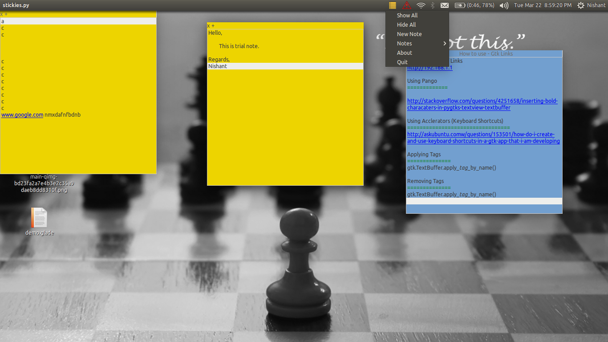
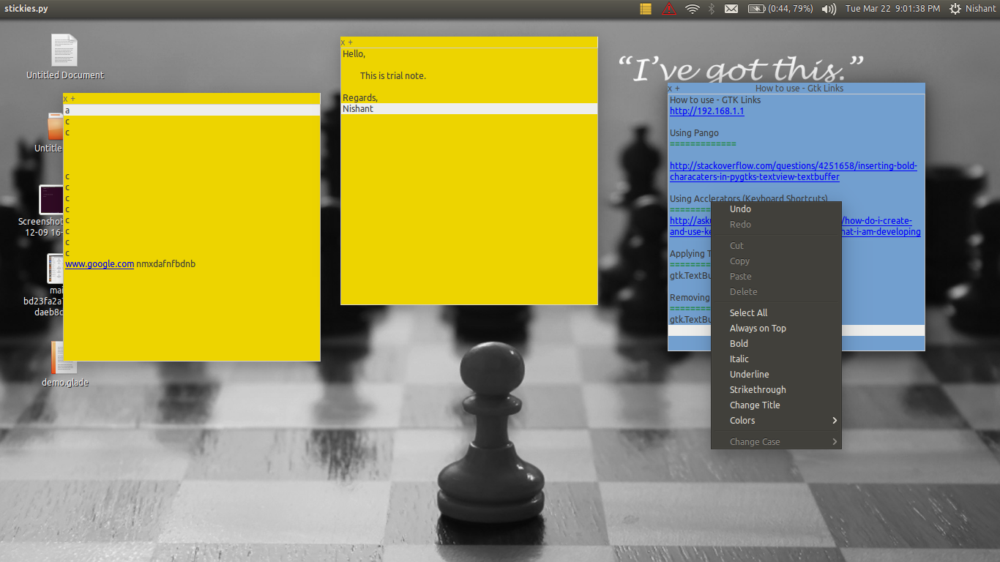
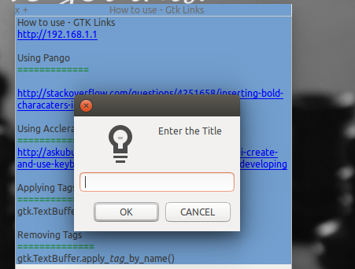
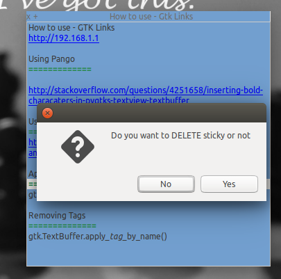

========================
Sticky Notes for Ubuntu
========================
Stick your notes to your desktop

Features
==========
* Markdown Support
* Links support (ctrl + left click opens link in default browser)
* Collapse/ Expand your notes 
* Delete/ Hide individual notes
* Hide All/ Show All notes at once
* Set the title of match (default title: first 40 characters  of note - shown when note is collapsed)
* Change color of notes
* Formatting Support (currently only bold is supported)

Screenshots
=============

=================
WORK IN PROGRESS
=================